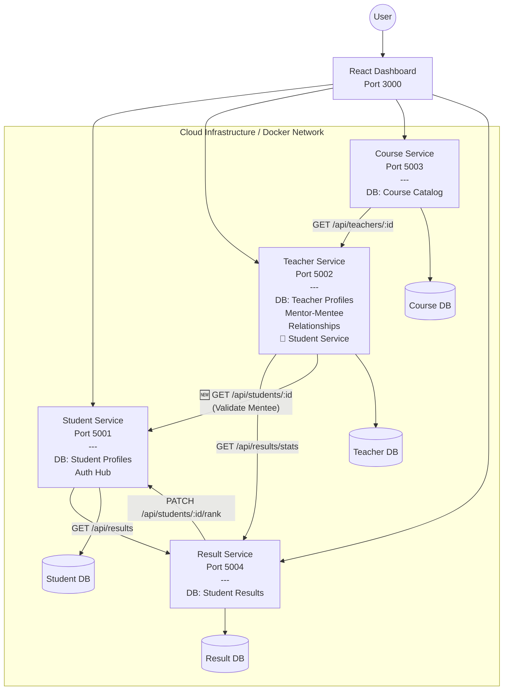

# Teacher Service - Mentor-Mentee Architecture

## Updated System Architecture



---

## Teacher Service Integration Details

### Data Flow: Adding a Mentee

```
Frontend Request
    ↓
POST /api/teachers/{id}/add-mentee
{studentId: "xxx"}
    ↓
Teacher Service Validates:
  1. Student ID is provided ✓
  2. Teacher exists ✓
  3. Student doesn't already exist as mentee ✓
    ↓
Teacher Service calls Student Service:
  GET http://student-service:5001/api/students/{studentId}
    ↓
Student Service responds with student details
    ↓
Teacher Service adds mentee to Teacher.mentees array
    ↓
201 Created Response with updated teacher object
```

---

## Single Teacher's Mentor-Mentee Relationship

```
┌─────────────────────────────────────────────┐
│           Teacher Record                    │
├─────────────────────────────────────────────┤
│ _id: ObjectId                              │
│ name: "Jane Johnson"                       │
│ email: "jane@school.com"                   │
│ subject: "Physics"                         │
│ bio: "15 years experience"                 │
│                                            │
├─── Mentees Array ───────────────────────┤
│ [                                          │
│   {                                        │
│     studentId: ObjectId                   │
│     studentName: "Alice Cooper"           │
│     studentEmail: "alice@school.com"      │
│     addedDate: "2024-03-21T10:30:00Z"    │
│   },                                       │
│   {                                        │
│     studentId: ObjectId                   │
│     studentName: "Bob Smith"               │
│     studentEmail: "bob@school.com"        │
│     addedDate: "2024-03-21T10:32:00Z"    │
│   }                                        │
│ ]                                          │
└─────────────────────────────────────────────┘
```

---

## API Endpoint Reference Quick Card

### Mentor Management Endpoints

#### 1️⃣ Add Student as Mentee
```
POST /api/teachers/{teacherId}/add-mentee
Content-Type: application/json

{
  "studentId": "{studentId}"
}

✅ 201 Created - Student added as mentee
❌ 400 Bad Request - Student already a mentee
❌ 404 Not Found - Student or Teacher not found
```

#### 2️⃣ View All Mentees
```
GET /api/teachers/{teacherId}/mentees

✅ 200 OK - Returns mentee list with count
❌ 404 Not Found - Teacher not found
```

#### 3️⃣ Remove Mentee
```
DELETE /api/teachers/{teacherId}/mentees/{studentId}

✅ 200 OK - Mentee removed
❌ 404 Not Found - Teacher or Mentee not found
```

#### 4️⃣ Teacher Dashboard
```
GET /api/teachers/{teacherId}/dashboard

✅ 200 OK - Returns:
   - Teacher profile
   - All mentees
   - Mentee count
   - Class statistics
   - Welcome message
```

---

## Service Dependencies

### Docker Compose Startup Order

```
1. Databases (all in parallel)
   └─ student-db
   └─ teacher-db
   └─ course-db
   └─ result-db

2. Services (with dependencies)
   └─ student-service (depends on: student-db)
   └─ teacher-service (depends on: teacher-db, student-service) ← 🆕 Depends on Student Service
   └─ course-service (depends on: course-db)
   └─ result-service (depends on: result-db)

3. Frontend
   └─ frontend (depends on: all services)
```

---

## Environment Variables

### Teacher Service Configuration

```bash
# Required
PORT=5002
MONGO_URI=mongodb://teacher-db:27017/teacher_db

# Existing
RESULT_SERVICE_URL=http://result-service:5004

# 🆕 New - For Mentor-Mentee Feature
STUDENT_SERVICE_URL=http://student-service:5001
```

---

## Cross-Service Communication Matrix

| From | To | Method | Endpoint | Purpose |
|------|----|---------| ---------| ---------|
| Teacher | Student | GET | `/api/students/:id` | Validate student exists before adding as mentee |
| Teacher | Result | GET | `/api/results/stats/subject/:subject` | Get class statistics for dashboard |
| Course | Teacher | GET | `/api/teachers/:id` | Get teacher info for course details |
| Result | Student | PATCH | `/api/students/:id/rank` | Update student rank after grades posted |

---

## Backward Compatibility

✅ **No Breaking Changes**

- All existing endpoints remain functional
- Existing teachers have empty `mentees` array
- New functionality is purely additive
- Existing API contract maintained
- Database schema expansion (not modification)

---

## Error Handling Flowchart

```
POST /api/teachers/:id/add-mentee
{studentId}
    │
    └─→ studentId provided?
        ├─ No  → 400 "Student ID is required"
        └─ Yes → Continue
            │
            └─→ Fetch student from Student Service
                ├─ Not Found → 404 "Student not found in Student Service"
                └─ Found     → Continue
                    │
                    └─→ Teacher exists?
                        ├─ No  → 404 "Teacher not found"
                        └─ Yes → Continue
                            │
                            └─→ Mentee already exists?
                                ├─ Yes → 400 "Student already a mentee"
                                └─ No  → Continue
                                    │
                                    └─→ Add mentee to array + Save
                                        │
                                        └─→ 201 "Student added as mentee"
```

---

## Testing Workflow

```
1. Start Services
   $ docker-compose up --build

2. Create Student
   POST /api/students → {name, email, age, grade}
   Save: STUDENT_ID

3. Create Teacher
   POST /api/teachers → {name, email, subject, bio}
   Save: TEACHER_ID

4. Add Mentee (Test Success)
   POST /api/teachers/{TEACHER_ID}/add-mentee
   {studentId: STUDENT_ID}
   ✓ Should return 201

5. Add Same Mentee Again (Test Duplicate Prevention)
   POST /api/teachers/{TEACHER_ID}/add-mentee
   {studentId: STUDENT_ID}
   ✓ Should return 400

6. View Mentees
   GET /api/teachers/{TEACHER_ID}/mentees
   ✓ Should show 1 mentee

7. Remove Mentee
   DELETE /api/teachers/{TEACHER_ID}/mentees/{STUDENT_ID}
   ✓ Should return 200

8. Verify Removal
   GET /api/teachers/{TEACHER_ID}/mentees
   ✓ Should show 0 mentees
```

---

## Documentation Files

| File | Purpose |
|------|---------|
| `IMPLEMENTATION_SUMMARY.md` | Complete list of all changes made |
| `TEACHER_SERVICE_MENTOR_GUIDE.md` | Detailed API reference with responses |
| `TEACHER_MENTOR_TEST_EXAMPLES.md` | Full curl examples for testing |
| `README.md` | Updated with new feature overview |

---

## Key Features Summary

✅ Mentor-Mentee Registration
✅ Student Validation (with Student Service)
✅ Duplicate Prevention
✅ Mentee List Management
✅ Dashboard with Statistics
✅ Full CRUD Operations
✅ Error Handling
✅ Service-to-Service Communication
✅ Backward Compatible
✅ Comprehensive Documentation
