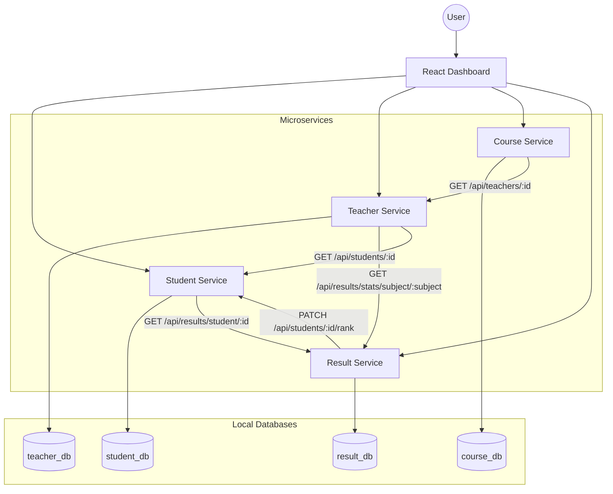

# School Management System (Microservices)

Cloud-ready microservices project for CTSE (SE4010), implemented with 4 backend services and a React frontend.

## Overview

- Frontend: React + Vite
- Backends: Node.js + Express (4 microservices)
- Datastores: isolated MongoDB containers per service for local development
- Deployment target: Azure Container Apps via ARM template
- CI/CD: GitHub Actions with build, scan, image push, and deploy workflows

For a detailed narrative summary, see [PROJECT_OVERVIEW.md](PROJECT_OVERVIEW.md).

## Architecture Diagram



## Services and Responsibilities

1. Student Service
- Auth endpoints (register/login)
- Student profile endpoints
- Dashboard aggregation using Result Service

2. Teacher Service
- Teacher profile endpoints
- Mentor/mentee management
- Subject stats integration with Result Service

3. Course Service
- Course management endpoints
- Teacher enrichment for full course info

4. Result Service
- Result creation and retrieval
- Subject-level stats
- Rank synchronization to Student Service

## Key API Endpoints

OpenAPI contracts:
- [docs/openapi/student-service.openapi.yaml](docs/openapi/student-service.openapi.yaml)
- [docs/openapi/teacher-service.openapi.yaml](docs/openapi/teacher-service.openapi.yaml)
- [docs/openapi/course-service.openapi.yaml](docs/openapi/course-service.openapi.yaml)
- [docs/openapi/result-service.openapi.yaml](docs/openapi/result-service.openapi.yaml)

### Student Service
- POST /api/auth/register
- POST /api/auth/login
- POST /api/students
- GET /api/students
- GET /api/students/:id
- GET /api/students/:id/dashboard
- PATCH /api/students/:id/rank

### Teacher Service
- POST /api/teachers
- GET /api/teachers
- GET /api/teachers/:id
- GET /api/teachers/:id/class-stats
- POST /api/teachers/:id/add-mentee
- GET /api/teachers/:id/mentees
- DELETE /api/teachers/:id/mentees/:studentId
- GET /api/teachers/:id/dashboard

### Course Service
- POST /api/courses
- GET /api/courses
- GET /api/courses/:id
- GET /api/courses/:id/full-info

### Result Service
- POST /api/results
- GET /api/results/student/:studentId
- GET /api/results/stats/subject/:subject

## Security Highlights

- Security headers with Helmet in all services
- Rate limiting in all services
- Password hashing and JWT issuance in Student Service
- Secret-based parameter model in apps.json for cloud deployment

## DevOps and CI/CD

Workflows are in .github/workflows:

- ci-cd.yml
    - Installs dependencies
    - Runs lint checks for each service
    - Runs automated Jest tests for each service
    - Runs Snyk scan
    - Builds Docker images
    - Pushes images to Docker Hub on main branch

- deploy-*.yml workflows
    - Service-specific deploy pipelines for frontend and each backend service

- deploy-arm-template.yml
    - Full-stack deployment using apps.json and secure parameters

## Local Run

1. Install Docker Desktop.
2. From project root, run:

```bash
docker-compose up --build
```

3. Access frontend:
- http://localhost:3000

4. Service ports:
- student-service: 5001
- teacher-service: 5002
- course-service: 5003
- result-service: 5004

## Cloud Deployment

- Template file: apps.json
- Managed platform: Azure Container Apps
- Deploy using:
    - GitHub workflow: .github/workflows/deploy-arm-template.yml
    - Or Azure CLI with required secure parameters

## Repository Structure

```text
.
├─ .github/workflows/
├─ frontend/
├─ services/
│  ├─ student-service/
│  ├─ teacher-service/
│  ├─ course-service/
│  └─ result-service/
├─ apps.json
├─ docker-compose.yml
└─ PROJECT_OVERVIEW.md
```