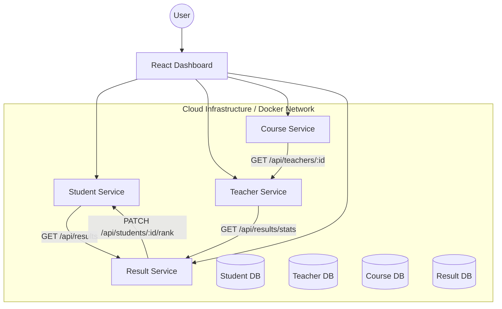

# SLIIT | DEPARTMENT OF COMPUTER SCIENCE & SOFTWARE ENGINEERING
## Module: Current Trends in Software Engineering (SE4010)
### Cloud Computing Assignment - School Management System (SMS)

---

## 1. Shared Architecture Diagram
The following diagram illustrates the four microservices, their isolated databases, and the creative inter-service communication paths.

---

## 2. Microservice Rationale
Each service represents a core component of a cohesive educational ecosystem:
- **Student Service**: Responsible for high-availability learner profile management.
- **Teacher Service**: Manages faculty records and provides subject-level analytics.
- **Course Service**: Serves as the curriculum hub, ensuring course data is enriched with faculty insights.
- **Result Service**: Acts as the central grading and synchronization engine.

---

## 3. Inter-Service Communication (With Examples)
Services integrate via RESTful APIs over an internal network:
- **Example 1**: The `Result Service` sends a `PATCH` request to the `Student Service` to update a student's `rank` (milestone) immediately after a grade is posted.
- **Example 2**: The `Course Service` performs a `GET` request to the `Teacher Service` to include the instructor's bio when a user explores course details.

---

## 4. Security & Access Control (Advanced RBAC)
The system implements a granular **Role-Based Access Control (RBAC)** system. Users can register as one of 5 types, with the dashboard dynamically restricting visibility based on their profile.

| Role | Access Restricted To |
| :--- | :--- |
| **Master Admin** | Superuser access to all services and data. |
| **Student** | Can only interact with the **Student Hub**. |
| **Teacher** | Can only interact with **Teacher Command**. |
| **Course Lead** | Can only interact with **Course Navigator**. |
| **Result Lead** | Can only interact with **Grading Portal**. |

- **Security Implementation**: The `Student Service` acts as the Authentication Hub.
- **Login Persistence**: Sessions are secured via local browser storage.
- **UI Logic**: Responsive sidebar allows each member to demonstrate their specific service in isolation.

---

## 5. Challenges & Solutions
- **Challenge**: Resolving Cross-Origin Resource Sharing (CORS) between the frontend and multiple back-end services.
- **Solution**: Implemented `cors` middleware across all Node.js services to securely allow required origins.
- **Challenge**: Synchronizing state (Rank) across disparate databases.
- **Solution**: Implemented an event-driven style REST hook where the `Result Service` triggers a rank update in the `Student Service`.

---

## 6. API Contract (Contractual Summary)
| Service | Method | Endpoint | Description |
| :--- | :--- | :--- | :--- |
| **Student** | POST | `/api/students` | Register a new student |
| **Student** | GET | `/api/students/:id/dashboard` | Integration: Fetch profile + results |
| **Teacher** | GET | `/api/teachers/:id/class-stats` | Integration: Fetch subject analytics |
| **Course** | GET | `/api/courses/:id/full-info` | Integration: Fetch course + faculty bio |
| **Result** | POST | `/api/results` | Trigger: Save result + Update Student Rank |

---

## 7. How to Run Locally
1. Clone the repository.
2. Run `docker-compose up --build`.
3. Dashboard: `http://localhost:3000`.
4. Inspect DBs: See ports 27017-27020 in **MongoDB Compass**.