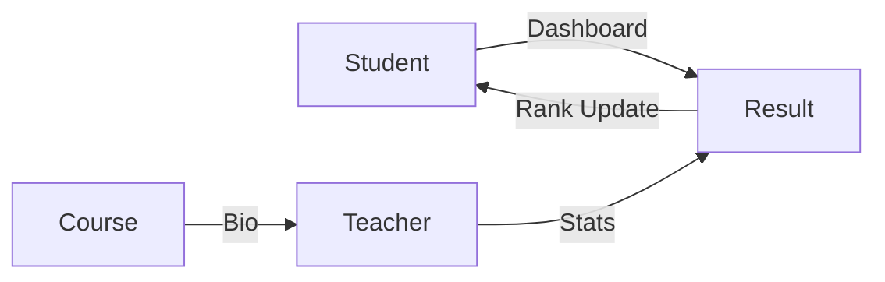

# School Management System - Microservices Assignment

## Objective
Design and implement a prototype of a secure, microservice-based application component using fundamental DevOps practices and cloud capabilities.

## Architecture Diagram
The system is divided into 4 microservices:
- **Student Service**: Manages learner profiles and academic ranks.
- **Teacher Service**: Manages faculty profiles and subject-wise performance stats.
- **Course Service**: Manages the curriculum with faculty lookup.
- **Result Service**: The grading engine that coordinates data across the ecosystem.



## Creative Integrations
1.  **Student Service**: Fetches real-time academic transcripts from the Result Service.
2.  **Teacher Service**: Aggregates class performance statistics from the Result Service.
3.  **Course Service**: Enriches course details with faculty bios from the Teacher Service.
4.  **Result Service**: Automatically updates student ranks in the Student Service based on marks entered.

## DevOps Practices
- **CI/CD**: GitHub Actions pipeline for automated builds and testing.
- **Containerization**: Docker and Docker Compose for easy orchestration.
- **Security**: DevSecOps integration with **Snyk** for dependency scanning.
- **Microservices**: Independently deployable services with isolated databases.

## How to Inspect Databases (For Viva)

Since each microservice has its own isolated database, you can inspect them using **MongoDB Compass** (Graphical UI) or the **Terminal**.

### 1. Using MongoDB Compass (Recommended)
Open MongoDB Compass and use the following Connection Strings:
- **Student DB**: `mongodb://localhost:27017`
- **Teacher DB**: `mongodb://localhost:27018`
- **Course DB**: `mongodb://localhost:27019`
- **Result DB**: `mongodb://localhost:27020`

### 2. Using Terminal (Docker Exec)
To see data inside the containers via command line:
```bash
# Example for Student Data:
docker exec -it sms-student-db-1 mongosh
use student_db
db.students.find().pretty()
```

## How to Run
1. Ensure Docker and Docker Compose are installed.
2. Run `docker-compose up --build`.

## API Documentation
Endpoints are documented in the respective service controllers:
- Student Service: Port 5001
- Teacher Service: Port 5002
- Course Service: Port 5003
- Result Service: Port 5004